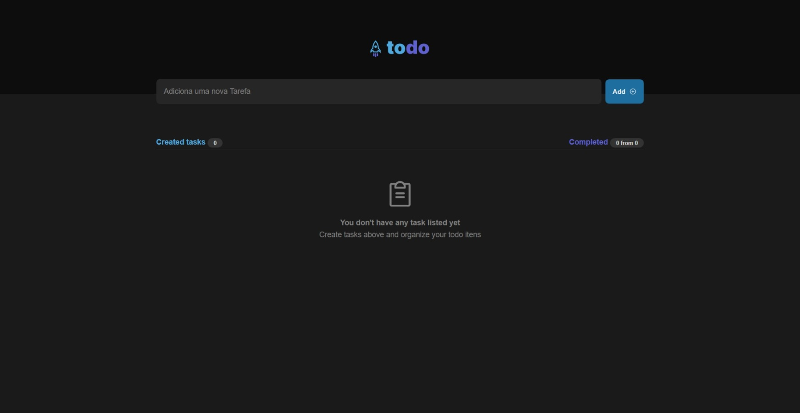
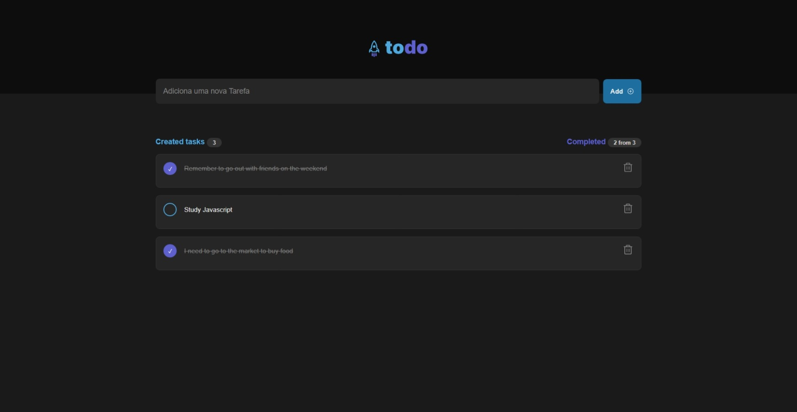
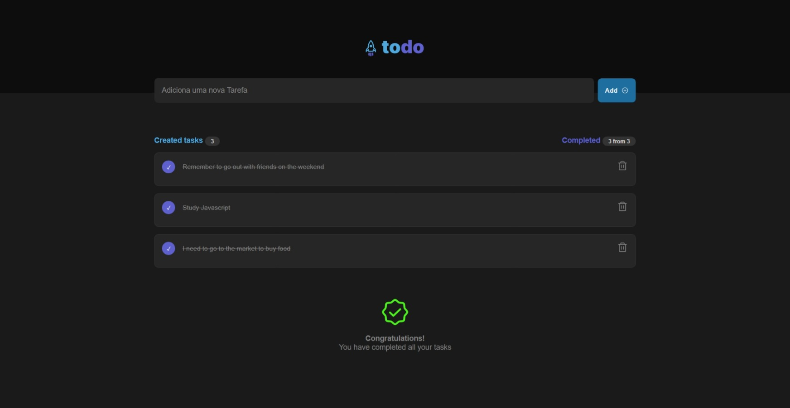

# Todo APP

Todo App where is possible to add task in your list, delete and check them when completed or not.

## ✨ Technologies

To develop this project the following technologies were used.:

- [React](https://reactjs.org)
- [TypeScript](https://www.typescriptlang.org/)

## 💻 Project

## 📚 About Project

- Component;
- Props;
- State;

## 🔖 Layout

You can view the project layout through [this link](<https://www.figma.com/file/i7pC4YRganNhYc3aINMuKO/ToDo-List-(Copy)?node-id=56%3A96>).

## 🚀 How to run

- Clone the repository
- Install dependencies with `yarn`
- Start the server with `yarn dev`

## 📷 Prints

  

  

  

Made with love 💙

